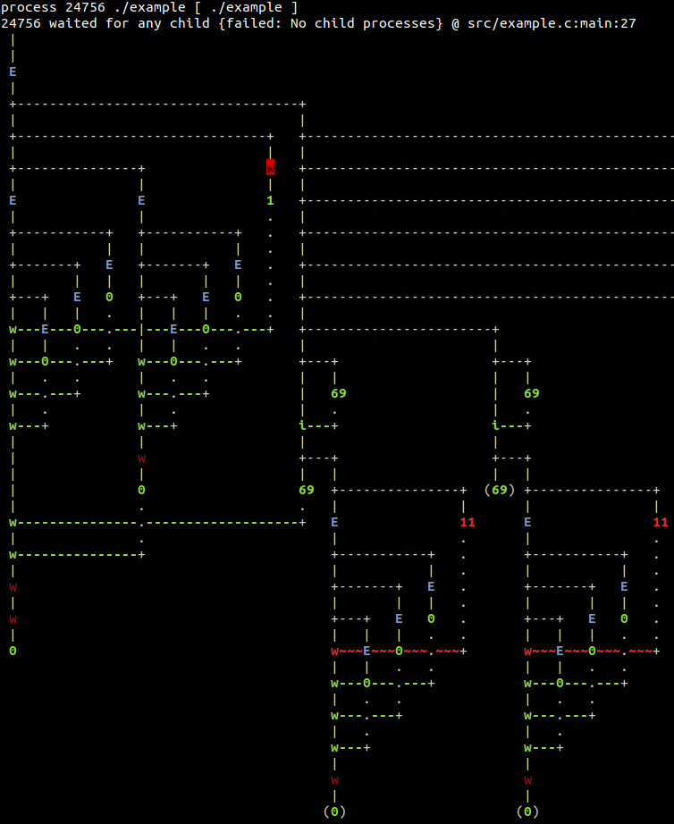

# forktrace
This is a program (specifically for Linux) that allows the user to step through
and view the process tree generated by a program.

## Building it
Use gcc/g++ (clang could work, idk). You'll need a version of g++ recent enough
that it supports C++17. You'll need make obviously. `build-essentials` should
probably have what you need. 

You'll need the ncurses, readline and fmt libraries (the latter is C++ only).
On my Ubuntu system, these libraries have the following package names:

- `libncurses-dev`
- `libreadline-dev`
- `libfmt-dev`

Use your package manager to install them. You can also quite easily build and
install `libfmt` from source like I did (just clone their git repo, then run
`cmake . ; make ; sudo make install` inside it).

## How it works
This project consists of two programs that work together: tracer and reaper.
reaper should not be used by the user and is only for internal use by tracer.
The tracer (the program is named forktrace) will try to search for reaper in

1. $PATH
2. The working directory

The reaper is used by the tracer to detect orphaned processes. It configures
itself as a subreaper process (see the man page for the prctl system call).

The program can be used to generate the fork diagram resulting from a program
in one go. E.g., via:

    forktrace <program> [args...]

If forktrace is given no arguments, then it starts up in command line mode. You
can type "help" to see a list of available commands. Features include:

1. Being able to run and stop the process tree.
2. Being able to step through one level at a time.
3. Being able to view the diagram in a scrollable curses view.

You can try the example that comes with the repo:

    make
    forktrace --help
    forktrace ./example
    
This is what (part of) the rendered diagram would look like:

It's a big diagram, but the example that comes with the repo is a big example!

### forktrace.h
The header file "forktrace.h" used by the example program does some hackery
so that certain syscalls are redefined so that they provide tracer with source
line location information. This is done by calling a dummy syscall and giving
it the information as arguments. tracer then catches this syscall and retrieves
the source location info from it. This is MUCH easier to implement than what
gdb does, but requires the program to be specially compiled. "forktrace.h" is
intended to be able to be used with any program.

Just include it into the files where you want those syscalls defined by it to
be traced. I'm working on a new feature that 'injects' this header into your
program automatically but that's not implemented yet.

## Status
Who cares.

## Old version of this project
This repo is a newer version of github.com/hddharvey/fdiag. The old version
used `LD_PRELOAD` to replace fork etc. with wrappers that generated log
messages which were converted into a diagram by a Python script. Interestingly,
this "newer" version actually seems to be slower than the older version by a
significant amount (the old version was 3x faster on a single test I ran).
I suspect that the bottleneck here is that the tracees block on every single 
system call until the tracer can receive the wait notification and unblock the 
tracee. This somewhat serialises the whole process, whereas in the old version,
everything just chugged along at full speed while the parser script tried to 
keep up with the log messages. Of course, everything else would be faster (the
diagram rendering, etc.) since it's written in C++ instead of Python.
